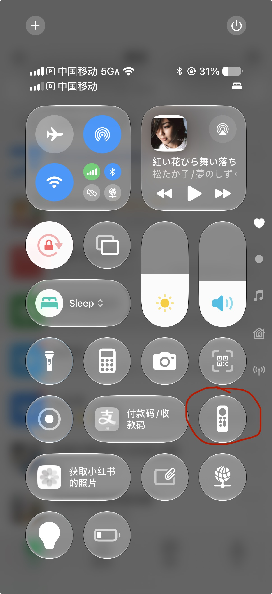

# Fake Apple TV (atv-core) 📺

> [English Version](README.md) | **中文版本**

**把 iPhone 里自带的「Apple TV 遥控器」，变成 Android 电视和 Mac 的遥控器。** 下拉控制中心、选中设备，即可直接操控——无需越狱、无需在手机上装 App、无需额外硬件。

<!-- TODO: 把下面的图替换成 15–30 秒实机录屏：
     控制中心 → Apple TV 遥控器 → 选择设备 → 操控电视 / Mac。
     保存为 docs/images/zh/demo.gif 后替换  的 src。 -->

### iPhone：找到遥控器，开始使用

从屏幕右上角下滑打开控制中心，点击「Apple TV 遥控器」，选择已运行接收程序的设备并完成配对，就可以滑动和点按操作。

| **找到遥控器** | **使用遥控器** |
| :---: | :---: |
|  |  |
| **屏幕右上角下滑**打开控制中心，点击红圈标记的遥控器图标<br>*(若未显示，前往 **设置 → 控制中心** 手动添加)* | 上方触控板滑动导航 / 移动光标<br>下方点按确认、返回、播放、音量等功能按键 |

📖 完整图文教程与演示：[博客文章](https://corvo.myseu.cn/2026/09/27/2026-09-27-%E7%94%A8iPhone%E9%81%A5%E6%8E%A7%E5%99%A8%E6%8E%A7%E5%88%B6%E4%BD%A0%E7%9A%84Android-TV%E5%92%8CMac/)

---

## 下载

预编译包已附在[最新 Release](https://github.com/corvofeng/atv-core/releases/latest)：

| 平台 | 下载 |
| :--- | :--- |
| macOS（Apple Silicon） | [`AppleTVRemote-arm64.dmg`](https://github.com/corvofeng/atv-core/releases/latest/download/AppleTVRemote-arm64.dmg) |
| macOS（Intel） | [`AppleTVRemote-x86_64.dmg`](https://github.com/corvofeng/atv-core/releases/latest/download/AppleTVRemote-x86_64.dmg) |
| Android TV / Google TV | [`FakeAtv-release.apk`](https://github.com/corvofeng/atv-core/releases/latest/download/FakeAtv-release.apk) |

想自己编译？见[从源码构建](#从源码构建)。

---

## 兼容性

| | 支持范围 | 说明 |
| :--- | :--- | :--- |
| **遥控端** | 控制中心带原生 **Apple TV 遥控器**的 iPhone / iPad | 手机侧无需安装任何 App |
| **macOS 被控端** | Apple Silicon 与 Intel Mac（菜单栏 App + CLI） | 需授予「辅助功能」权限 |
| **Android 被控端** | Android TV、Google TV、电视盒子、模拟器 | 需开启网络 ADB，见[功能限制](#功能限制) |
| **网络** | 遥控端与被控端处于同一局域网 | 需关闭 AP 隔离 / 访客网络 |

**已测试机型** <!-- TODO: 补充你的真实测试矩阵，例如 iOS 17.x / macOS 14 (Apple Silicon) / 索尼 Bravia Google TV、小米盒子、模拟器 API 30 -->：

- iOS / iPadOS：_待补充_
- macOS：_待补充_
- Android TV 设备：_待补充_

### 功能限制

- **Android TV 必须开启网络 ADB。** Android 禁止普通应用向其它 App 注入方向键 / 确认键，因此按键注入依赖本地 ADB 通道；无障碍服务仅作兜底，并负责全局返回 / 主页动作。完整步骤见 [Android TV 前置要求](#android-tv)。
- **配对使用固定 PIN。** iPhone 提示输入配对码时，输入 **`1111`** 即可。
- macOS 版使用自签名证书签名，首次启动 Gatekeeper 会告警，见 [macOS 前置要求](#macos)。

---

## 快速上手

1. 从[下载](#下载)获取 DMG（Mac）或 APK（Android TV）并安装。
2. **让 iPhone 与被控端接入同一 Wi-Fi**（关闭 AP 隔离）。
3. **授予权限**——macOS 授予辅助功能；Android TV 开启网络 ADB 并在弹窗中点「始终允许」。详见下文。
4. **打开控制中心找到遥控器**：
   - 屏幕右上角向下滑动呼出**控制中心**，点击红圈标记的 **Apple TV 遥控器** 图标。
   - *(若控制中心未显示该图标，去 iOS **设置 → 控制中心**，在「更多控制」中添加「Apple TV 遥控器」即可)*。
   - 顶部选择你的目标设备，提示配对码时输入 **`1111`** 即可开始使用。

### macOS

安装后 macOS Gatekeeper 会拦截自签名应用，放行一次即可：

```bash
# 方式 A（推荐）：信任项目内置证书
./scripts/import_certificate.sh Corvo_Development.p12

# 方式 B：移除隔离属性
xattr -dr com.apple.quarantine /Applications/AppleTVRemote.app
```

然后授予 **系统设置 → 隐私与安全性 → 辅助功能 → AppleTVRemote**（用命令行调试则勾选终端）。启动应用后即可通过菜单栏图标使用。

### Android TV

1. **开启开发者选项**：系统设置 → 关于 → 连续点击**内部版本号** 7 次。
2. **开启 USB 调试与网络调试**：系统设置 → 系统 → 开发者选项。
3. 安装并启动 APK。首次运行会弹出 Android 安全对话框——用电视遥控器勾选**「始终允许来自此计算机」**并点**允许**。（点拒绝会导致 `Unauthorized`，遥控失效。）
4. *（可选兜底）*开启无障碍服务：主界面 → **ACCESSIBILITY SETTINGS** → 找到 **Apple TV Remote Receiver** → 打开。

> **为什么需要 ADB？** Android 禁止普通应用向第三方影视 App 注入全局方向键 / 确认键。内置的 `dadb` 驱动连接 `127.0.0.1:5555`，直接派发 Linux keycode（本地回环实测 <8 ms）。无障碍服务无法独立完成这件事，只能作兜底与全局返回 / 主页动作。

---

## 按键与手势映射

| Apple TV 遥控器动作 | Android TV | macOS |
| :--- | :--- | :--- |
| **滑动（方向模式）** | `KEYCODE_DPAD_UP/DOWN/LEFT/RIGHT` | 方向键 `↑ ↓ ← →` |
| **滑动（鼠标模式）** | 触摸拖拽 / 光标 | `CGEvent` 平滑光标 |
| **轻触 / SELECT** | `KEYCODE_DPAD_CENTER` | 回车 / 鼠标左键 |
| **返回（`<`）** | `GLOBAL_ACTION_BACK` | `Escape` |
| **电视 / Home** | `GLOBAL_ACTION_HOME` | 桌面 / 可自定义 |
| **单击 ⏯** | `KEYCODE_MEDIA_PLAY_PAUSE` | 播放 / 暂停（`NX_KEYTYPE_PLAY`） |
| **双击 ⏯** | 下一集 / 快进 | 下一曲（⏭） |
| **三击 ⏯** | 上一集 / 快退 | 上一曲（⏮） |
| **音量 +/-** | `KEYCODE_VOLUME_UP/DOWN` | 主音量 + 原生 HUD |
| **静音** | `KEYCODE_VOLUME_MUTE` | 系统静音 |
| **侧边 Siri 键** | 语音搜索（`KEYCODE_SEARCH`） | 切换 光标 ⇄ 方向键 / Siri |
| **电源** | `GLOBAL_ACTION_POWER_DIALOG` | 屏幕睡眠 / 唤醒 |

---

## 从源码构建

```bash
# macOS —— 打包独立 DMG
./scripts/build_dmg.sh
# → build/AppleTVRemote-arm64.dmg，拖入 /Applications

# Android TV —— 编译并安装 APK
./scripts/build_android.sh
adb install -r android-tv/app/build/outputs/apk/debug/app-debug.apk
adb shell am start -n com.corvofeng.fakeatv/.MainActivity
```

---

<details>
<summary><h2 style="display:inline">开发者文档与实现原理</h2></summary>

### Android 模拟器桥接

在 Android Studio 的 Android TV AVD 中测试时使用（物理设备无法发现模拟器隔离的 NAT 子网 `10.0.2.15`）：

```bash
# 1. 启动 Android TV AVD（API 30+），用 adb devices 确认
# 2. 安装接收端
./scripts/build_android.sh
adb -s emulator-5554 install -r android-tv/app/build/outputs/apk/debug/app-debug.apk
adb -s emulator-5554 shell am start -n com.corvofeng.fakeatv/.MainActivity

# 3. 启动桥接守护进程
python3 scripts/bridge_emulator.py start        # 或 start -f（前台实时日志）
python3 scripts/bridge_emulator.py status       # 端口转发与 mDNS 状态
python3 scripts/bridge_emulator.py logs -f      # 跟踪日志
python3 scripts/bridge_emulator.py stop         # 停止
```

随后在 iPhone → 控制中心 → Apple TV 遥控器 → 选择 **`Android TV Emulator`** → 输入 PIN `1111`。

桥接通过 `adb forward` 透传 `49152/49153/49154` 端口，并把 Bonjour 记录（`_mediaremotetv._tcp`、`_companion-link._tcp`）代理广播到物理 Wi-Fi，因此 iPhone 连接宿主机后会被透明路由到模拟器。


### macOS Web 控制面板（端口 8765）

启动守护进程或菜单栏 App 后，浏览器访问 **`http://127.0.0.1:8765`**：


- 实时触摸矢量画布：手指坐标、手势阶段（`Began`/`Moved`/`Ended`）、速度矢量与方向判定。
- 网页端虚拟遥控器，无需拿手机即可触发 Mac / 电视响应。
- 动力学预设：`0.5x 精准`、`1.0x 标准`、`1.5x 快速`、`2.2x 极速大屏`。
- 已连接设备信息与实时音量遥测。

### macOS 宿主诊断（端口 8766）

访问 **`http://127.0.0.1:8766`** 查看进程健康、端口绑定与实时协议握手：


- 会话跟踪：Companion 客户端接入、SRP 认证、MRP 加密信道建立。
- 进程遥测：核心 API（`8765`）、Web 调试（`8766`）、MediaRemote（`49152`）、后台 PID、日志过滤、重启控制。

### 触摸板手势与焦点累加

Companion Link 协议以高频流式发送增量坐标。`atv-core` 将其转换为网格焦点移动（Android TV）或带加速度的光标位移（macOS）：


1. **增量累加器**——聚合微位移，抑制抖动与误触。
2. **方向死区**——判定水平 / 垂直意图，过滤对角噪声。
3. **平台分发**——Android TV 触发 `KEYCODE_DPAD_*`；macOS 按速度计算加速度曲线并通过 `CGEvent` 派发。

### 驱动调度层级


- **Android**——首选：`dadb` 回环连接 `127.0.0.1:5555` 直接派发 keycode；兜底：无障碍服务处理全局窗体动作。
- **macOS**——辅助功能 API（`CGEvent`）驱动光标 / 键盘；CoreAudio / MediaRemote 联动硬件音量与媒体 HUD。

### Android TV 看板与配置

| 主仪表板 | 按键注入模式 | Menu 键映射 |
| :---: | :---: | :---: |
|  |  |  |

- **驱动健康状态**：`/dev/input/event*`、本地 `dadb`（`127.0.0.1:5555`）、`AtvAccessibilityService`。
- **注入策略**：*仅本地 ADB*、*仅无障碍*、*ADB 优先（无障碍兜底）*、*硬件优先*。
- **Menu 键重映射**：将 播放/暂停、Home 或 静音 映射为 `KEYCODE_MENU`，适配老电视应用。

**无障碍设置界面：**

| 服务列表 | 授权确认 | 就绪状态 |
| :---: | :---: | :---: |
|  |  |  |

</details>

---

## 常见问题排查（FAQ）

**控制中心找不到设备？**
1. 确认 iPhone 与被控端在同一 Wi-Fi 子网（关闭 AP 隔离 / 访客模式）。
2. macOS 上运行 `dns-sd -B _mediaremotetv._tcp` 检查 Bonjour 广播。
3. 模拟器场景检查桥接：`python3 scripts/bridge_emulator.py status`。

**电视按键无反应 / ADB 连接失败？**
1. 确认开发者选项里「网络调试」与「USB 调试」已开启。
2. 重启应用，留意 RSA 指纹授权弹窗——勾选**「始终允许」**并点**允许**。
3. 若无弹窗，从电脑执行 `adb connect <电视IP>:5555` 触发首次信任。

**Android TV 找不到无障碍设置？**
部分定制系统隐藏了该菜单。使用应用内的「ACCESSIBILITY SETTINGS」弹窗，或执行：
```bash
adb shell settings put secure enabled_accessibility_services com.corvofeng.fakeatv/.AtvAccessibilityService
adb shell settings put secure accessibility_enabled 1
```

**macOS 提示应用损坏 / 来自不受信任的开发者？**
```bash
xattr -dr com.apple.quarantine /Applications/AppleTVRemote.app
# 或信任内置证书：
./scripts/import_certificate.sh Corvo_Development.p12
```

---

## 许可证

MIT。仅供技术学习与局域网设备互通研究使用。
